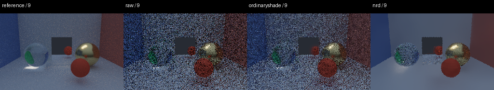

# Moving optics investigation — 2026-09-06

Measured on NVIDIA GeForce RTX 4070 Laptop GPU, driver 580.95.05,
Vulkan capture, native WebGPU OrdinaryShade shader replay, and NRD 4.18.0.
Both sequences contain 16 frames at 256x160, 1 spp input, with a separate
128-spp reference per viewpoint. Geometry is static; the camera holds, moves
sideways, then holds. The two runs travel 0.6 and 3.0 scene units, respectively.
NRD reconstruction uses a fixed 60-Hz frame interval.

See [runner and interpretation boundaries](../../tools/denoiser_motion/README.md).
Reports retain shader hashes, policies, exact acceptance fractions, region
errors and adapter identity. Arrays, acceptance/history maps and GIFs are in
`/tmp/optics-motion-reviewed` and `/tmp/optics-motion-fast-reviewed` locally;
original reusable captures are `/tmp/optics-motion-final` and
`/tmp/optics-motion-fast`. Temporary artifacts are not required for rerunning.

## Findings

At moderate speed the motion history cap is six frames and roughly 70% of
pixels pass temporal validation. Removing only the cap has little effect.
At fast speed the cap is one frame despite roughly 41–43% acceptance. With
history length one, the temporal blend uses only the current sample, regardless
of acceptance. Spatial filtering continues to run.

Whole-sequence normalized log-luminance RMSE (lower is better):

| Camera speed | Raw | OrdinaryShade | Same shaders, no motion cap | NRD RELAX |
|---|---:|---:|---:|---:|
| Moderate | 0.8231 | 0.5063 | 0.5042 | 0.3630 |
| Fast | 0.8194 | 0.6994 | 0.6037 | 0.4053 |

The stationary-region temporal residual metric drops from 0.7525 to 0.6017
without the cap and to 0.1683 with NRD in the fast sequence. This measures
frame-to-frame error relative to the reference, not a direct perceptual score.
Removing the cap also slightly reduces the minimum edge correlation
(0.4217 to 0.4072). It is not evidence for unconditionally retaining long history.

Fast-sequence per-object log-RGB RMSE (lower is better):

| Region | OrdinaryShade | No motion cap | NRD | Disagreement between independent 64-spp references |
|---|---:|---:|---:|---:|
| Glossy | 0.1463 | 0.1118 | 0.1034 | 0.0331 |
| Mirror | 0.0544 | 0.0287 | 0.0355 | 0.0225 |
| Glass | 0.0924 | 0.0767 | 0.0772 | 0.0330 |

NRD provides a broader room-level improvement, but does not uniformly win on
optics. Reference noise is material relative to small regional differences.
Glass inputs are outside NRD's opaque-surface contract, and neither denoiser
receives reflected/refracted-surface motion here. These results do not establish
a production glass solution or live Vulkan input-preparation parity.

## Corrections required for a valid experiment

- Offscreen tracing accepted `frame_index` but omitted it when updating the
  camera buffer used by RNG initialization. Independent frame captures were
  therefore repeating samples. The frame index is now forwarded, with a
  regression test.
- The legacy NRD bridge used combined world-to-clip matrices as projections,
  with identity view matrices and unsuitable serialization for this purpose.
  Diagnostic input version 2 supplies split column-major projection/view
  transforms. Legacy callers remain available but are not valid moving-camera
  reference comparisons.
- NRD's default frame interval follows wall-clock time. Offline upload and
  subprocess timing changed temporal weights between replays. The quality
  replay now fixes the interval to 1/60 second.

A repeated moderate-speed replay was image-exact for OrdinaryShade, its
uncapped variant and NRD. Adding the acceptance output was also image-exact
for both OrdinaryShade variants. Tests: 639 passed, 117 skipped, 74 subtests
passed; the two native GPU diagnostic sequences were exercised separately.

## Recommended next work

First, replace the global motion-footprint cap with a tested policy that can
retain trustworthy per-pixel history during fast motion. Keep reactive and
geometry rejection; expand the test matrix before changing defaults, especially
for moving objects, changed lighting and disocclusion trails.

In parallel as a subsequent milestone, audit live and captured lobe
attribution, material demodulation, hit distances and optical motion. The
current canonical capture is not enough to rank production specular backends.
NRD is a useful quality reference, but adopting it would require a resident
runtime integration and a distinct strategy for transmission.
