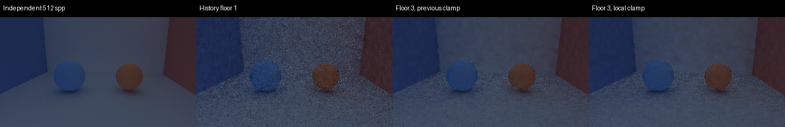

# Live edge audit and surface-local temporal clamp — 2026-09-06

The original edge-correlation failure was not reliable evidence that retaining
three frames destroyed scene edges. The old gate selected the strongest raw
luminance gradients from a 16-spp reference; only 15.2% of those selected pixels
were near captured geometry boundaries in this fixture. Monte Carlo noise and
shared sample sequences confounded that score.

We captured the actual live denoiser inputs and history images, then rendered
independent 512-spp references through the **same live Vulkan path**. The
original floor-one and floor-three candidate images were reproduced exactly
with guide capture enabled. Reference seeds start at 1000 rather than sharing
the candidates' sequence. Eight independent 64-spp batches are averaged at
each of seven camera positions. Two interleaved 256-spp averages have a
log-luminance disagreement of 0.00338.

An initial offscreen-reference experiment was excluded: its average brightness
differed from live rendering. The same-path reference matches the live mean.
Offscreen/live radiance parity remains a separate issue to investigate.

## Results against the matched independent reference

| Metric (lower is better except correlation) | Floor 1 | Floor 3, previous clamp | Floor 3, surface-local clamp |
|---|---:|---:|---:|
| Normalized log-luminance RMSE | 0.3102 | 0.1831 | 0.1832 |
| Motion-region RMSE | 0.3644 | 0.1805 | 0.1807 |
| Geometry-boundary log-luminance RMSE | 0.01881 | 0.01398 | 0.01401 |
| Geometry-gradient RMSE | 0.03402 | 0.02517 | 0.02526 |
| Edge correlation (higher is better) | 0.0080 | 0.2093 | 0.2214 |

With a three-frame floor, geometry-boundary error decreases on every frame
after the initial history-free frame. The previous interpretation of the old
gate is therefore revised: this fixture supports retaining short history.
This does not establish safety for all moving optics or lighting conditions.
The floor remains explicitly selectable, and the historical baseline is not
silently replaced.

The local-clamp change is nearly neutral in aggregate room metrics; it is not
the source of the large floor-one/floor-three improvement.



## Specific shader correction

Previously, temporal clamp/reactive statistics used every pixel in the current
3x3 neighborhood even across object/material boundaries. In a controlled test,
a dark one-pixel surface surrounded by a different bright surface could have
its history clamped toward the foreign surface's brightness when its own light
switched off.

During motion, the neighborhood now requires matching material and stable
instance identity, plus a compatible normal. The center remains included.
Statistics therefore describe the surface whose history is being validated.
The stationary policy is unchanged. The shader still rejects incompatible
history, reacts to changed lighting, and honors cuts and history limits.

The new GPU regression fails with the previous shader and passes with the
corrected shader. Existing checks also pass for moving-surface tracking,
disocclusion, lighting changes, camera cuts and bounded history.

SPIR-V and WGSL are regenerated from the OrdinaryShade source. Live guide
readback is an offline diagnostic requiring `denoiser_signal_capture=True`;
transfer-source image usage is added only under that option.

## Reproduce

```bash
python -m tools.denoiser_motion.live_edges --output /tmp/live-edge-audit-new
python -m tools.denoiser_motion.analyze_edges /tmp/live-edge-audit-new
python -m tools.denoiser_motion.check_rejection
```

This requires Vulkan ray queries, a desktop display for the hidden live
presenter, and WebGPU for the separate shader checks. No NRD dependency is
needed for this audit. Raw guide/reference arrays stay in the output directory;
these checked-in summaries are [previous](previous.json) and [local](local.json).

The legacy gate remains useful for reproducing historical behavior, but its
16-spp gradient-correlation threshold must not be treated as a standalone
measure of edge preservation. Future baseline work should use independent
same-path references, geometry-boundary errors, and temporal disocclusion tests.

Validation: 642 tests passed, 117 skipped, 74 subtests passed; generated shader
artifacts verified; all six GPU rejection checks passed. The
[default live camera/object-motion gate](default-gate.json) passes its existing
baseline with no threshold changes.
